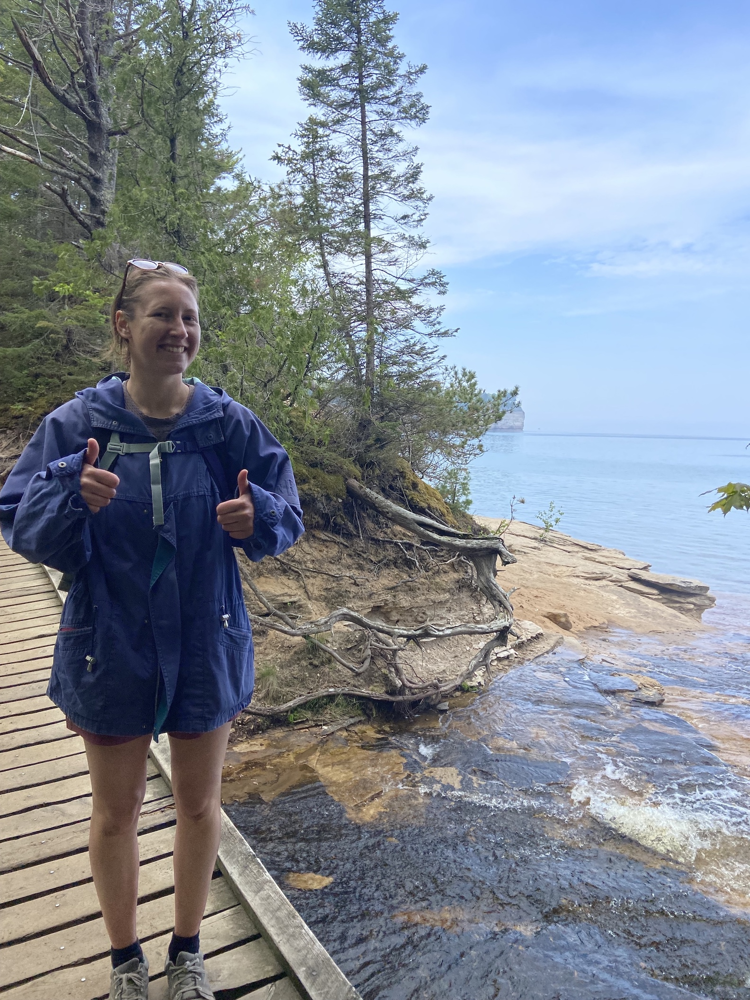

# About Me

## Hello! My name is Julia Eckberg (she/her) 

{: width="350px"}

I am a PhD candidate at the University of Michigan working on plant community ecology with a focus on plant-insect interactions and global change. I studied at Kenyon College in Gambier, Ohio for my undergraduate degree where I majored in Biology with a minor in History. As an undergraduate, I conducted research on the macroecology of North and South American bryophytes and the plasticity of plant defense, particularly cyanogensis. If I'm not at work, I'm probably at the Ann Arbor District Library making some amateur art. 

[CV](2024_EckbergCV.pdf)

